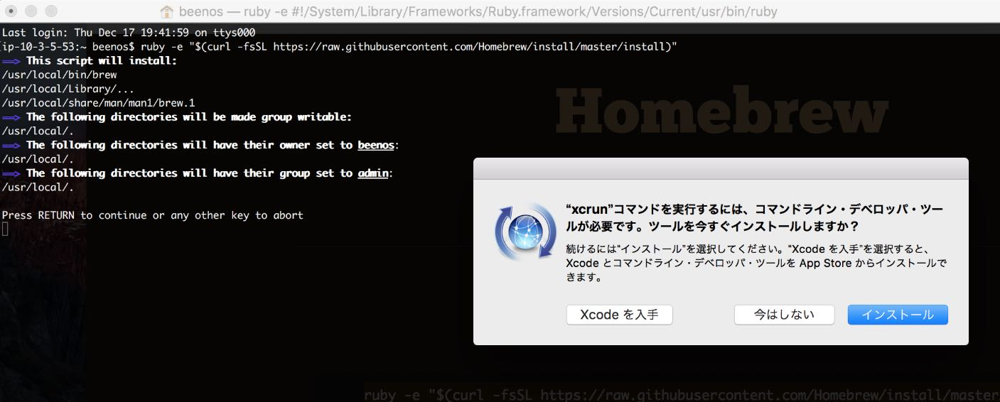
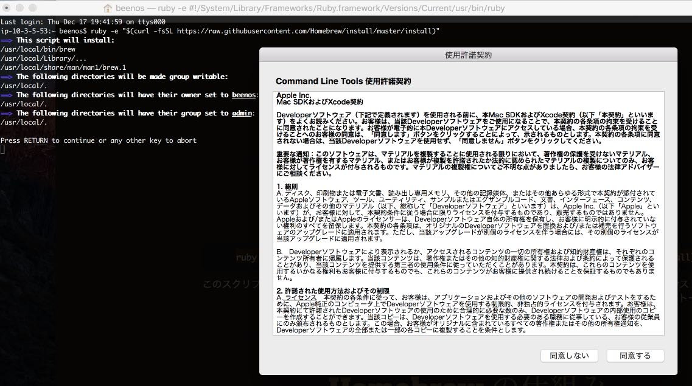
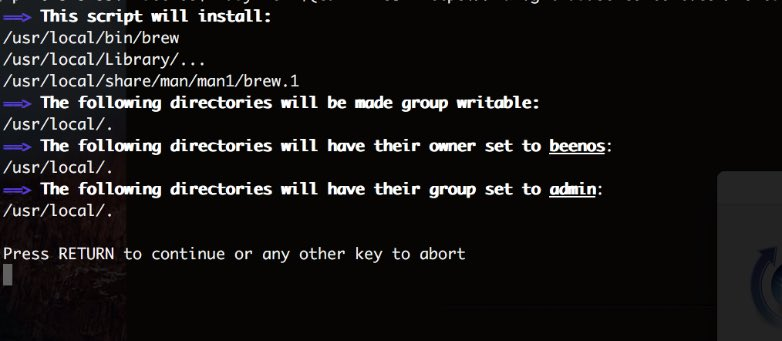
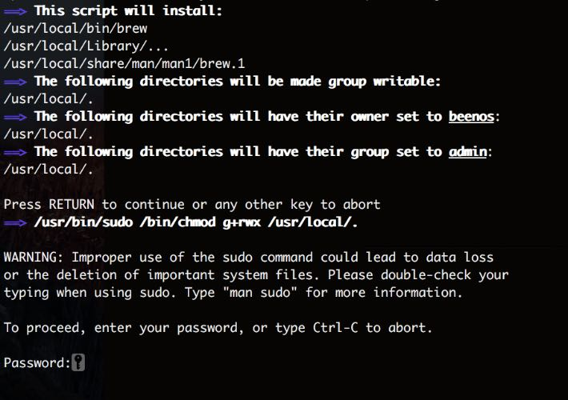
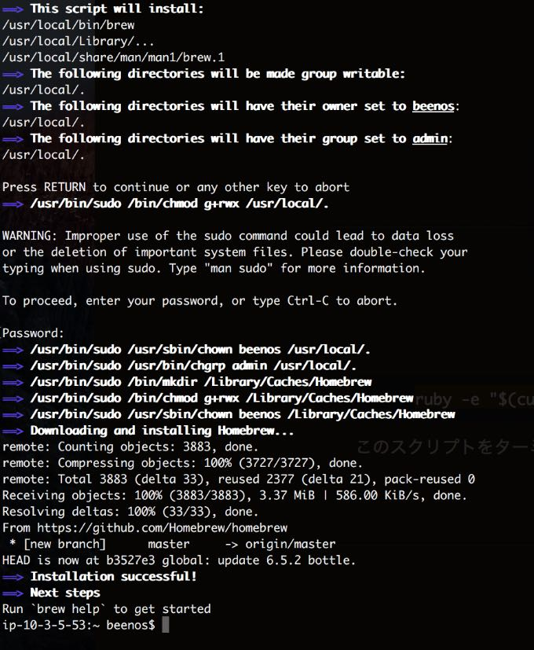

# 環境構築(Mac)

Macには[Homebrew](http://brew.sh/index_ja.html)という、色々なツールやアプリケーションを簡単にインストールするためのツールがあります。(パッケージマネージャーと言います)

- [Homebrew](http://brew.sh/index_ja.html)

## Homebrewのインストール

下記コマンドをターミナルで実行します。

```sh
$ ruby -e "$(curl -fsSL https://raw.githubusercontent.com/Homebrew/install/master/install)"
```

実行した時に、`Xcode Command Line Tools` のインストールを求められるので、 `インストール` を押してインストールしてください。



`インストール` をクリックすると、Command Line Toolsの使用許諾契約が表示されるので、 `同意する` をクリックしてください。  
クリックするとインストールがはじまるので、少し待ちましょう。



しばらくすると `Press RETURN to continue or any other key to abort` と表示されるので、 `return` キーを押してください。



マシンのユーザーのパスワードの入力を求められるので、入力してください。



インストールが完了すると、 `Installation successful!` というメッセージが表示されます。



インストールが成功すると、 `brew` コマンドが使用できるようになります。確認のために、Homebrewのバージョンを確認するコマンドを実行してみましょう。  
下記のように、バージョンが表示されれば成功です。

```sh
$ brew -v
#=> Homebrew 0.9.5 (git revision b352; last commit 2015-12-17)
```

## Gitをインストールする

GitはMac(OSX)に標準でインストールされていますが、最新のバージョンのものをHomebrewでインストールしてみましょう。  
`brew install パッケージ名` でインストールができます。

```sh
$ brew install git
```

### PATHを通す

Homebrewは `/usr/local/bin` にインストールしたパッケージのバイナリを配置するので、gitのようなデフォルトでインストールされているライブラリは  
デフォルトでインストールされてるgitが優先して実行されてしまいます。

```sh
$ git --version
#=> git version 2.5.4 (Apple Git-61)

$ which git
#=> /usr/bin/git
```

Homebrewでインストールしたパッケージを優先的に使用するには、環境変数 `PATH` に `/usr/local/bin` を優先するように、  
shell(デフォルトではBash)の設定ファイルに記述する必要があります。

```sh
$ echo 'export PATH="/usr/local/bin:$PATH"' > ~/.bash_profile
$ source ~/.bash_profile
```

完了したら、バージョンを確認してみましょう。(2015-12-17現在、gitの最新バージョンは2.6.4)

```sh
$ git --version
#=> git version 2.6.4
$ which git
#=> /usr/local/bin/git
```

上記のような表示であれば、設定は完了です!

