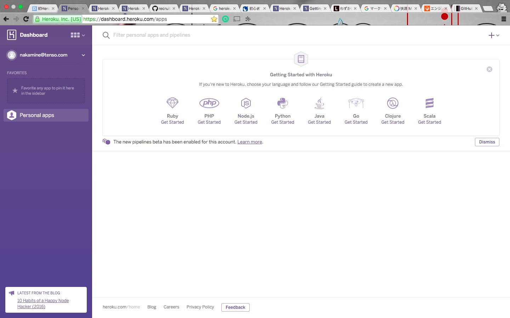

# STEP1. heroku アカウントの作成

**注: herokuのアカウントを持っている場合、このステップは飛ばして問題ありません**  

必要なもの:

* メールアカウント

## 手順

1. [公式ページ](https://www.heroku.com/)にアクセスします。
2. 'Sign Up For Free' をクリック
3. 必要な情報を入力して、'Create Free Accout' をクリックします。

    メインの開発言語は何でもかまいません。
    スクリーンショットでは PHP にしました。

    

    Sign Up ページで入力したメールアカウントに、'Comfirm your account on Heroku'というメールが届くので、
    メールのリンクをクリックし、パスワードを設定する画面に進みます。

4. パスワードを設定し、'Set Password and log in' をクリック

    

    スクリーンショットのようなDashboardのページが表示されていれば成功です

	
