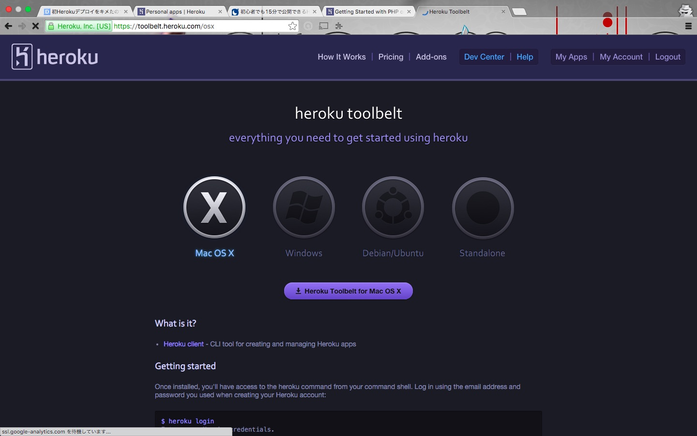

# STEP2. heroku-toolbeltのインストール

**注: heroku-toolbeltがすでにローカルマシンにいストールされている場合、このステップは飛ばして問題ありません**  

## 目的

* heroku-toolbelt をローカルマシンにインストールし、
コマンドラインから heroku の操作ができるようにする

## 手順

### Homebrewを使う場合

以下のコマンドでインストールできます

```sh
$ brew install heroku-toolbelt
```

### Herokuからパッケージをダウンロードする場合

1. [公式ページ](https://toolbelt.heroku.com/)からheroku-toolbeltをダウンロードする

    

    ※ Mac 版と Windows 版がありますが、以下の手順では、Mac 版について説明します。Window 版も、基本的には同じことができます。

2. ダウンロードとインストールが終わったら、ターミナルを開く

  ※ Windows の場合は、コマンドプロンプトを開きます

3. ターミナルから、`heroku login` とタイプする

    ```sh
  $ heroku login
  ```

    ※ 初回起動の場合、依存パッケージやプラグインのインストールが走るので、
  少し時間がかかります。

4. 依存パッケージなどのインストールが終わったら、メールアドレスとパスワードの
入力が求められるので、画面にしたがって入力します。

    ```sh
  Enter your Heroku credentials.
Email: nakamine@tenso.com
Password (typing will be hidden):
    ```

  `Logged in as (heroku に登録したメールアドレス)` と表示されれば成功です。

    ```
  Logged in as nakamine@tenso.com
    ```

    ※ 二回目以降は、ログインパスワードを入力しなくても、heroku にログインできるように
    なります。

    ※ heroku-toolbelt のプラグインなどの情報は、~/.heroku に格納されます。    
