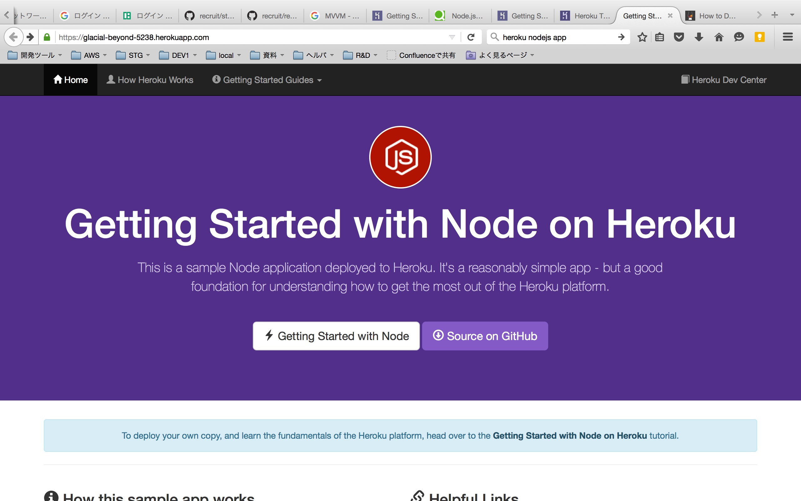

# STEP3. Node.js で作成したサーバアプリを heroku にデプロイする

## 目的

* ローカルマシン上で作成した Node.js のサーバアプリケーションを heroku にデプロイする

## 前提

* Node.js のプロジェクトは Git 管理されている

※ ここでは、サンプルプロジェクトを clone してデプロイする例を記述します。

## 手順

1.Node.js のサンプルプロジェクトを clone

```sh
$ git clone https://github.com/heroku/node-js-getting-started.git
$ cd node-js-getting-started
```

2.heroku上にアプリを生成

```sh
$ heroku create
```

※ package.json があると、デプロイ時に heroku が自動的に Node.js のアプリとみなしてくれます。
成功すると、以下のように表示されます:

```sh
ip-10-3-4-156:node-js-getting-started nakamine$ heroku create
Creating glacial-beyond-5238... done, stack is cedar-14
https://glacial-beyond-5238.herokuapp.com/ | https://git.heroku.com/glacial-beyond-5238.git
Git remote heroku added
```

3.アプリのデプロイ

```sh
$ git push heroku master
```

※ `heroku` というのが、heroku のリモートリポジトリを表します。
成功すると、以下のように表示されます。
※ `glacial-beyond-5238` などのアプリ名は、heroku がランダムに生成します。

```sh
ip-10-3-4-156:node-js-getting-started nakamine$ git push heroku master
Counting objects: 433, done.
Delta compression using up to 4 threads.
Compressing objects: 100% (337/337), done.
Writing objects: 100% (433/433), 222.12 KiB | 0 bytes/s, done.
Total 433 (delta 63), reused 433 (delta 63)
remote: Compressing source files... done.
remote: Building source:
remote:
remote: -----> Node.js app detected
remote:
remote: -----> Creating runtime environment
...以下略...
remote: -----> Compressing... done, 9.9MB
remote: -----> Launching... done, v3
remote:https://glacial-beyond-5238.herokuapp.com/ deployed to Heroku
remote:
remote: Verifying deploy.... done.
To https://git.heroku.com/glacial-beyond-5238.git
 * [new branch]  master -> master
```

4.デプロイされたアプリをブラウザ上で確認する

```sh
heroku open
```



## 参考

公式手順: [Getting Started with Node.js on Heroku](https://devcenter.heroku.com/articles/getting-started-with-nodejs#introduction)
