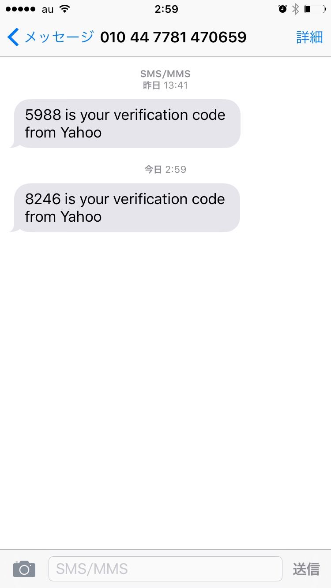

# Step1. flickrのアカウントを作成する

**注: flickrのアカウントを持っている場合、このステップは飛ばして問題ありません**  

今回の1dayインターンでは、flickrという写真共有サービスが提供しているAPIを使用します。

[flickr](https://www.flickr.com/)

flickrは[Yahoo.com](https://www.yahoo.com/)が提供しているサービスであり、利用するにあたりYahoo.comのアカウントが必要です。

## flickrとYahoo.comにサインアップ

1. [flickr](https://www.flickr.com/)にアクセスし、 `Sign up with Yahoo` をクリック

1. 必須項目を入力

- 携帯番号は `Japan` を選択し、番号の2桁目から入力してください
  - 例: `09011112222` の場合、 `9011112222` と入力する

1. SMSを使い、Verification codeの入力を行う

`Send SMS` をクリックしてSMSへVerification codeの送信を行い、SMSに送信されたVerification codeを入力します

1. 登録完了

登録完了すると、Congratulationsと表示され、Yahoo.comのトップにログインした状態でリダイレクトされます

1. flickrにログインする

[flickr](https://www.flickr.com/)にアクセスし、今度は右上の `Sign In` をクリックします

Yahoo.comにログインしてる状態なら、そのまま確認画面が出たのち、そのまますぐにログインできるはずです。 
また、ログインする際のメールアドレスはYahoo.comにサインアップした際に発行されるメールアドレスを入力します。
例えばアカウントを `beenos` で作成した場合、 `beenos@yahoo.com` というメールアドレスが発行されます。

