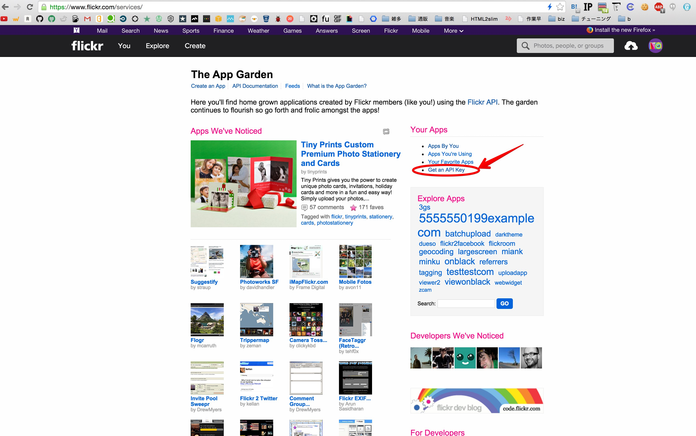
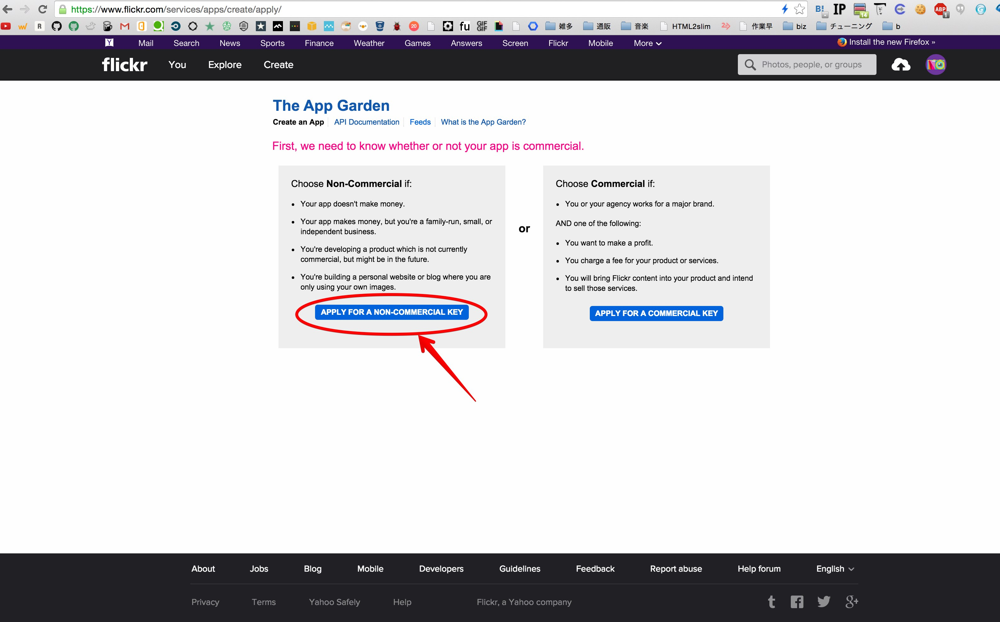
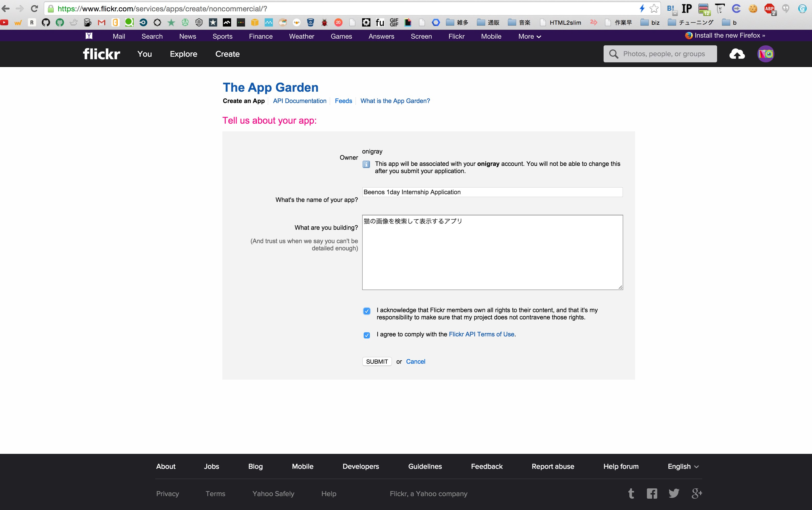
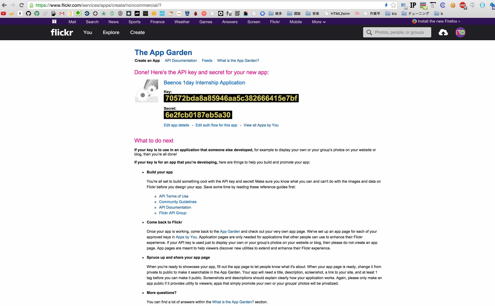

# Step2. アプリケーションを登録し、API Keyを取得する

APIを利用するにあたり、flickrの[The App Garden](https://www.flickr.com/services/)というページから、  
APIを利用するアプリケーションの登録と、そのアプリケーションで利用する `API Key` という認証情報を取得する必要があります。

- Api Keyについて

API Keyはアプリケーションとアプリケーションを登録したユーザーの識別情報となるため、基本的にアプリケーションの作者と管理者だけが知っておくべきで、一般的に公開するものではありません。

## アプリケーションの登録を行う

アプリケーションの登録を行う

1. [The App Garden](https://www.flickr.com/services/)にアクセスし、[Get an API Key](https://www.flickr.com/services/apps/create/apply/)をクリックします

1. 商用目的ではないので、`APPLY FOR A NON-COMMERCIAL KEY` をクリックします

1. 必須項目の入力を行い、 `SUBMIT` をクリックします
  - What's the name of your app?
    - これから作る自分のアプリケーションの名前を入力します
    - 好きな名前を付けてみましょう
      - 例: Beenos 1day Internship Application
  - What are you building?
    - これから作るアプリケーションの概要を書きます
      - 例: 猫の画像を検索して表示するアプリ
  - 利用規約に同意する2箇所のチェックボックスにチェック

1. このような画面が表示されたら完了です

