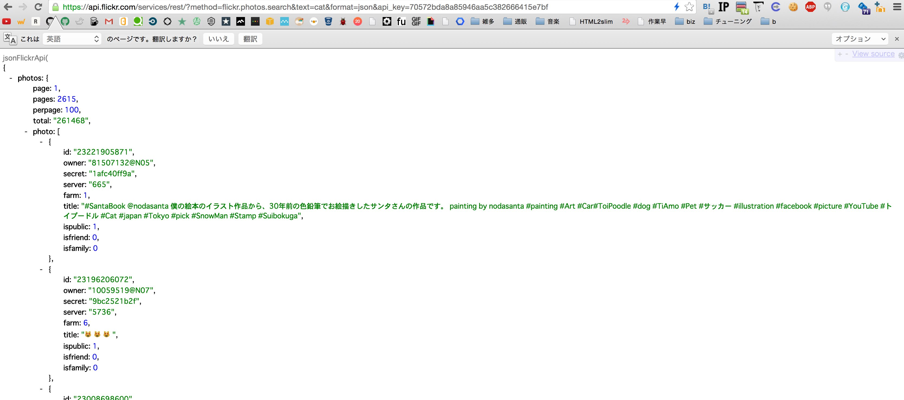
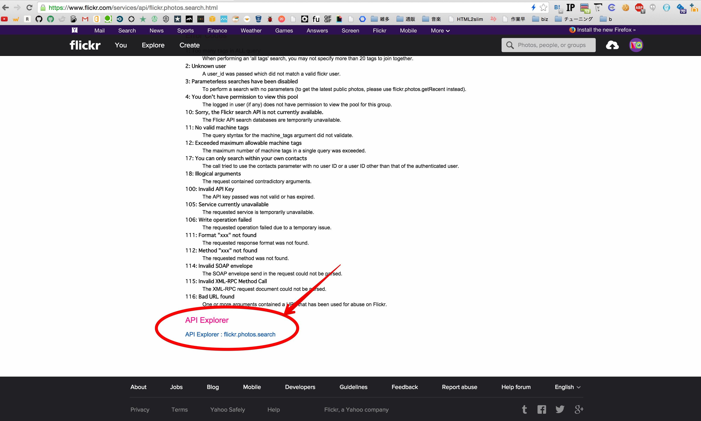

# Step3. APIを実際に使ってみる

flickrがAPIで提供している機能はたくさんあります。

[API Documentation](https://www.flickr.com/services/api/)

その中から今回は、写真検索の機能を使用します。

[flickr.photos.search](https://www.flickr.com/services/api/flickr.photos.search.html)

## タグ検索をしてみる

`Arguments` を組み合わせて詳細な検索ができるのですが、まずは単純にタグでの検索を行ってみましょう。
下記のURLに、 `API_KEY` を書き換えてブラウザからアクセスしてみてください。

```
https://api.flickr.com/services/rest/?method=flickr.photos.search&tags=cat&format=json&api_key=API_KEY
```

下記のように、たくさんの文字が表示されたらうまくいっています


これはJSONPと呼ばれるデータフォーマットで表示されてるものであり、Chromeであれば[JSONView](https://chrome.google.com/webstore/detail/jsonview/chklaanhfefbnpoihckbnefhakgolnmc)というエクステンションをインストールすれば、下記のようにブラウザから見やすく表示できます。



## 画像を見てみる

APIが返した情報(レスポンス)には、画像を見るのに必要な情報が揃っています。レスポンスの中にある情報をを下記のURLのように書き換えることにより、画像のURLを取得することができます。

- 画像URL

```
http://farm{farm}.staticflickr.com/{server}/{id}_{secret}.jpg
```

###### 例

- response

```json
{
  "photos": {
    "page": 1,
    "pages": 2615,
    "perpage": 100,
    "total": "261468",
    "photo": [
      {
        "id": "22676362374",
        "owner": "118119763@N02",
        "secret": "d27f777bb3",
        "server": "741",
        "farm": 1,
        "title": "My Grandma's New Kitten",
        "ispublic": 1,
        "isfriend": 0,
        "isfamily": 0
      },
      ...
    ]
  }
}
```

- 上記レスポンスから生成できる画像のurl

```
http://farm1.staticflickr.com/741/22676362374_d27f777bb3.jpg
```

以降のStepでは、このURLをレスポンスからプログラムを使って生成するといったことを行います。

## Tips: APIの検証を簡単に行いたい 

flickrのAPIには `API Explorer` というものがあり、APIの動作検証を簡単に行うための機能が用意されています。  
`API Explorer` は、各APIメソッドのドキュメントの一番最後にリンクがあります。

[https://www.flickr.com/services/api/explore/flickr.photos.search](https://www.flickr.com/services/api/explore/flickr.photos.search)

- [flickr.photos.search](https://www.flickr.com/services/api/flickr.photos.search.html)メソッドのドキュメントを一番下までスクロールするとリンクがある



試してみたい `Arguments` を入力し、 `Output` を `JSONP` に変更してから `Call Method` をクリックすると、結果を見ることができます。


各 `Arguments` の解説は、こちらのサイトが参考になります

[flickr APIの使い方まとめ(サンプルコード付き)](https://syncer.jp/flickr-api-matome#sec-5)

