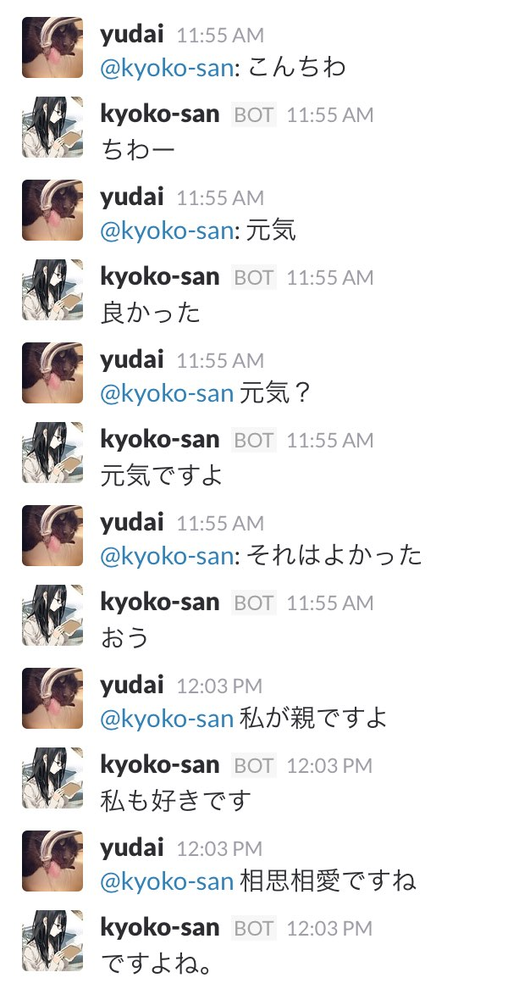

# Web APIってなに?

Web APIとは、インターネット(Web)を経由して、何らかの処理を行うための手段や決めごと(API)のことです。

昨今、Webサービスを提供している企業が、サービスが提供している機能をWeb APIとして公開するケースが増えています。(例: Google, Instagram, Facebook, Yahoo, etc...)  
これらのサービスが提供するWeb APIを利用することにより、色々なアプリケーションを簡単に作ることができます。

#### Web APIを利用したWebサイトの例

- [Nekostagram](https://nekostagram.com/)
  - [Instagram API](https://www.instagram.com/developer/)を使用
- [なに猫？マッチング](http://catmatch.ap.mextractr.net/)
  - [この猫なに猫?API](http://www.metadata.co.jp/whatcatapigaiyou.html)を使用
- [AZusaar!](http://azusaar.appspot.com/)
  - [複数のAPI](http://ma8.mashupaward.jp/works/14)を使用

Buyeeでは、[Slack](https://slack.com/)というチャットツールに常駐しているBot([Hubot](https://hubot.github.com/))に[docomoの雑談対話API](https://dev.smt.docomo.ne.jp/?p=docs.api.page&api_name=dialogue&p_name=api_reference)を連携させ、Botと雑談できるようにしています。

# 今回のインターンシップでは?

今回のインターンシップでは、[米Yahoo](https://www.yahoo.com/)が提供する[Flickr](https://www.flickr.com/)という写真共有サービスのWeb APIを利用し、アプリケーションを作成します。

# ちなみに

さまざまなWeb APIを利用してアプリケーションを開発し、競う[Mashup Awards](http://mashupaward.jp/)というコンテストがあります。エンジニア志望の学生も多く参加しているので、興味があれば是非参加してみてください。
